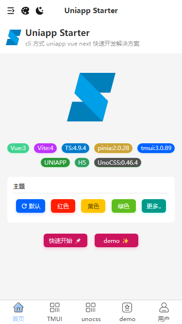
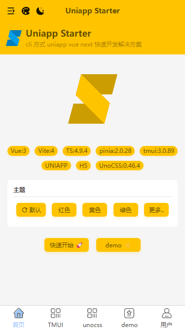
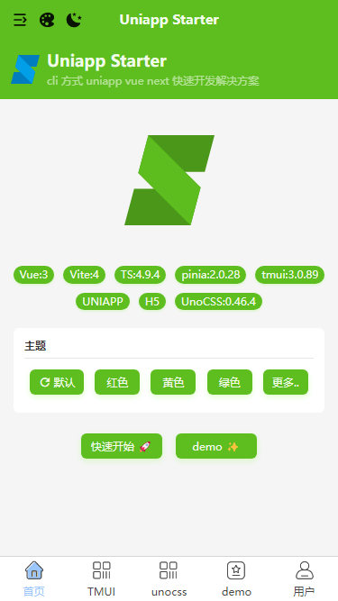
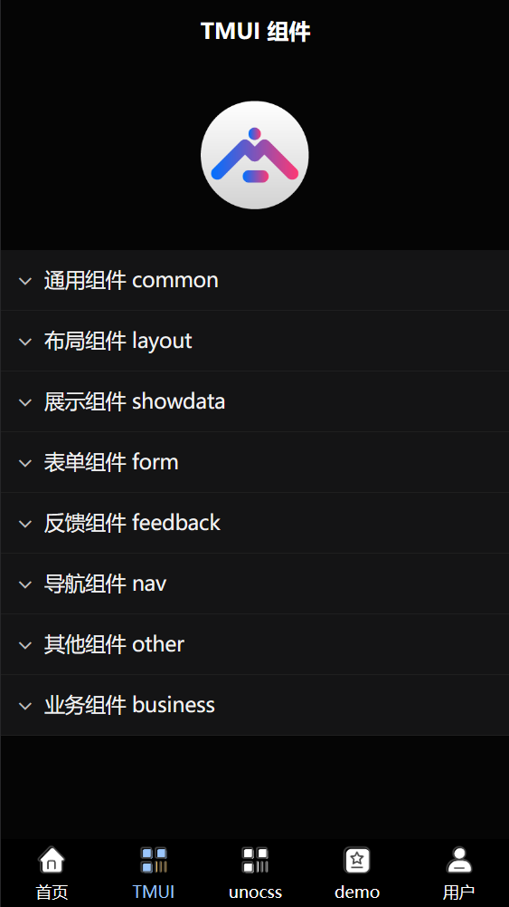
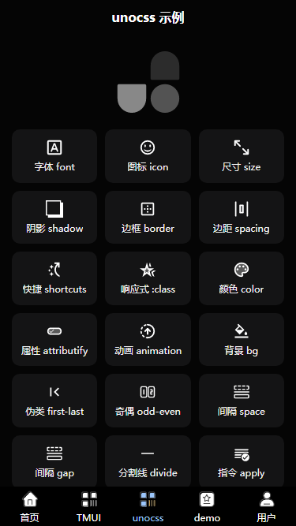

# uniapp vue next starter

**uniapp Vue3 Vite TypeScript 快速开发解决方案**，cli 方式创建， 集成 `TMUI` `UnoCSS`（实现零 CSS 开发），集成 `HBuilderX cli`（APP 模式一键打包：自定义基座、云打包）

仓储：<https://gitee.com/dodu/uniapp-starter>，线上示例：[live demo (H5)](http://uniapp-h5.5shiguang.net/)

## 特性

- **最新技术栈**：使用 Vue3/Vite4/pinia ,TypeScript 等前端前沿技术开发;
- **UI集成**：集成 [TMUI](https://tmui.design/) 跨端组件，支持 `nvue 原生渲染` `H5` `小程序` `安卓` `IOS` 等全端组件库;
- **[Unocss](https://github.com/unocss/unocss) 原子化 CSS**：预设图标：[preset-icons](https://github.com/unocss/unocss/tree/main/packages/preset-icons#readme) 使用 [iconify](https://github.com/iconify/iconify) 图标(可使用全网所有图标)，[unocss-preset-weapp](https://github.com/MellowCo/unocss-preset-weapp) 小程序支持，配置参考：[unocss.config.js](./unocss.config.js);
- **[@antfu/eslint-config](https://github.com/antfu/eslint-config)**：规范代码格式预设配置，统一编码，使用简单，去 Prettier（[为什么我不使用Pretier](https://antfu.me/posts/why-not-prettier-zh)）;
- **路由拦截**：基于 uni.addInterceptor 进行路由拦截;
- **请求拦截**：核心使用 [luch-request](https://ext.dcloud.net.cn/plugin?id=392)，支持请求和响应拦截等；
- **[mockjs](http://mockjs.com/) 集成**：H5 模式集成 mockjs，仅前端开发，并配置 api 统一响应结果：[ApiResult](./src/services/api/apiResult.ts)，支持泛型 `ApiResultOf<T>`，服务器端只需要符合 ApiResult 规范即可支持生产模式;
- **缓存加密**：使用 AES 加密缓存,可设置区分在开发或生成环境中是否加密;
- **[HBuilderX cli](https://hx.dcloud.net.cn/cli/README) 集成**：通过命令实现启动hbx、打包自定义基座、云打包(使用前需把cli集成到[环境变量](https://hx.dcloud.net.cn/cli/env))，打包配置参考：[uniapp.pack.json](./uniapp.pack.json)，该文件只是配置参考，实际使用的是 `uniapp.pack.json.local`，该文档从 `uniapp.pack.json` 复制，考虑多PC开发情况，配置可能不一样，为了不产生 git 变更而使用 `.local`，单PC环境，可直接使用 `uniapp.pack.json`；

## 示例











## 预览（H5、微信小程序）


## 说明

- cli 创建的 Vue3/ts 项目 与 使用 HBuilderX 导入插件的包有差异，请直接访问 [开源地址](https://gitee.com/dodu/uniapp-starter)
- 框架完全基于 Vue3 SFC `<script setup>` 语法糖写法(包含示例页面)，不支持 Vue2;
- 可用于学习与交流;
- 目前测试 H5、微信小程序,APP(Android)通过;
- 其他平台暂未测试,后续会增加;
- 如发现问题或建议可在评论区留言, 或提 [Issues](https://gitee.com/dodu/uniapp-starter/issues) 及 [PR](https://gitee.com/dodu/uniapp-starter/pulls)，尽可能及时处理;
- 如有需求亦可在评论区留言,或在此项目基础上增加;

## 安装使用

- 安装依赖

```bash
pnpm install
```

- 运行

```bash
# 其他端请查看 package.json script
pnpm dev:h5
pnpm dev:mp-weixin
pnpm dev:app
```

- 编译

```bash
# 其他端请查看 package.json script
pnpm build:h5
pnpm build:mp-weixin
pnpm build:app
```

- 打包

```bash
# 打包自定义基座
pnpm hbx:custom

# 云打包(apk)
pnpm hbx:pack
```

- 更新 uniapp cli 到最新

```bash
pnpm uniapp-cli:latest
```

## 目录结构

<details>
  <summary>打开/折叠</summary>
  <pre><code>├─ scripts
│   └─hbx.pack.js # 利用 HBuilderX cli 打包脚本
│
├─ src
│   ├─assets # 静态资源目录
│   │
│   ├─components # 组件目录
│   │   ├─ AppProvider
│   │   │    ├─index.vue
│   │   └─...
│   │
│   ├─enums # 枚举/常量
│   │   ├─ appEnum.ts
│   │   └─...
│   │
│   ├─hooks # 钩子
│   │   ├─ router.ts
│   │   └─...
│   │
│   ├─pages # 页面
│   │   ├─ index
│   │   │    └─index.vue
│   │   └─...
│   │
│   ├─pages-tmui # tmui 组件展示 和 示例 分包
│   │   └─...
│   │
│   ├─pages-unocss # unocss 示例
│   │   └─...
│   │
│   ├─pages-demo # demo 页面分包
│   │   └─...
│   │
│   ├─router # tmui 必须
│   │   └─index.ts
│   │
│   ├─services # 接口相关
│   │   ├─ api # api
│   │   │    ├─auth.ts
│   │   │    └─...
│   │   │
│   │   └─ model # 数据模型
│   │        ├─authModel.d.ts
│   │        └─...
│   │
│   ├─settings # 设置
│   │   └─ encryptionSetting # 加密设置
│   │
│   ├─state # 状态管理模式(pinia)
│   │   ├─ modules # 数据模块
│   │   │    ├─auth.ts
│   │   │    └─...
│   │   │
│   │   └─ index.ts
│   │
│   ├─static # 静态公共文件
│   │   ├─ images # 图片
│   │   │    ├─avatar.png
│   │   │    └─...
│   │   │
│   │   └─ ...
│   │
│   ├─theme # tmui 必须
│   │   └─index.ts
│   │
│   ├─tmui # tmui 组件
│   │   ├─ components
│   │   └─ ...
│   │
│   ├─types # 类型文件
│   │   ├─ http.d.ts
│   │   └─ ...
│   │
│   └─utils # 工具类
│       ├─ cache # 缓存相关目录
│       ├─ http  # request相关目录
│       ├─ interceptors  # 拦截器相关目录
│       └─ ...
│
├─ .env
├─ .env.development
├─ .env.production
├─ .eslintignore
├─ .eslintrc.js
├─ .gitignore
├─ .prettierignore
├─ .prettierrc.js
├─ favicon.ico
├─ index.html
├─ LICENSE
├─ package.json
├─ pnpm-lock.yaml
├─ README.md
├─ tsconfig.json
├─ uniapp.pack.json # HBuilderX cli 打包配置
├─ uniapp.pack.json.local # 实际使用的 HBuilderX cli 打包配置
├─ unocss.config.js
└─ vite.config.ts
</code></pre>
</details>

## Git 贡献提交规范

- 参考 [vue](https://github.com/vuejs/vue/blob/dev/.github/COMMIT_CONVENTION.md) 规范 ([Angular](https://github.com/conventional-changelog/conventional-changelog/tree/master/packages/conventional-changelog-angular))

  - `feat` 增加新功能
  - `fix` 修复问题/BUG
  - `style` 代码风格相关无影响运行结果的
  - `perf` 优化/性能提升
  - `refactor` 重构
  - `revert` 撤销修改
  - `test` 测试相关
  - `docs` 文档/注释
  - `chore` 依赖更新/脚手架配置修改等
  - `workflow` 工作流改进
  - `ci` 持续集成
  - `types` 类型定义文件更改
  - `wip` 开发中
